# E-Gramin Client Service Management Platform (CSMP): Complete Functional Architecture & Code Execution Flow

This master documentation provides an exhaustive, step-by-step technical breakdown of every major feature and workflow across the application, detailing frontend UI interactions, React Context state management, Supabase PostgreSQL persistence, Realtime WebSocket propagation, cross-tab synchronization, and security enforcement.

---

## Table of Contents
1. [System Architecture Overview](#1-system-architecture-overview)
2. [Authentication & Session Flow](#2-authentication--session-flow)
3. [Support Ticket Creation Flow](#3-support-ticket-creation-flow)
4. [Holding / Limit Deposit Request Flow](#4-holding--limit-deposit-request-flow)
5. [Holding / Limit Withdrawal & CMA Checkpoint Flow](#5-holding--limit-withdrawal--cma-checkpoint-flow)
6. [Request Status Transition Flow](#6-request-status-transition-flow)
7. [Operator Routing & Assignment Flow](#7-operator-routing--assignment-flow)
8. [Thread Messaging & Internal Staff Notes Flow](#8-thread-messaging--internal-staff-notes-flow)
9. [Two-Step Deletion & Approval Flow](#9-two-step-deletion--approval-flow)
10. [Role-Based Access Control (RBAC) Flow](#10-role-based-access-control-rbac-flow)
11. [Multi-Layer Real-Time Synchronization Engine](#11-multi-layer-real-time-synchronization-engine)
12. [Master Function Reference Index](#12-master-function-reference-index)

---

## 1. System Architecture Overview

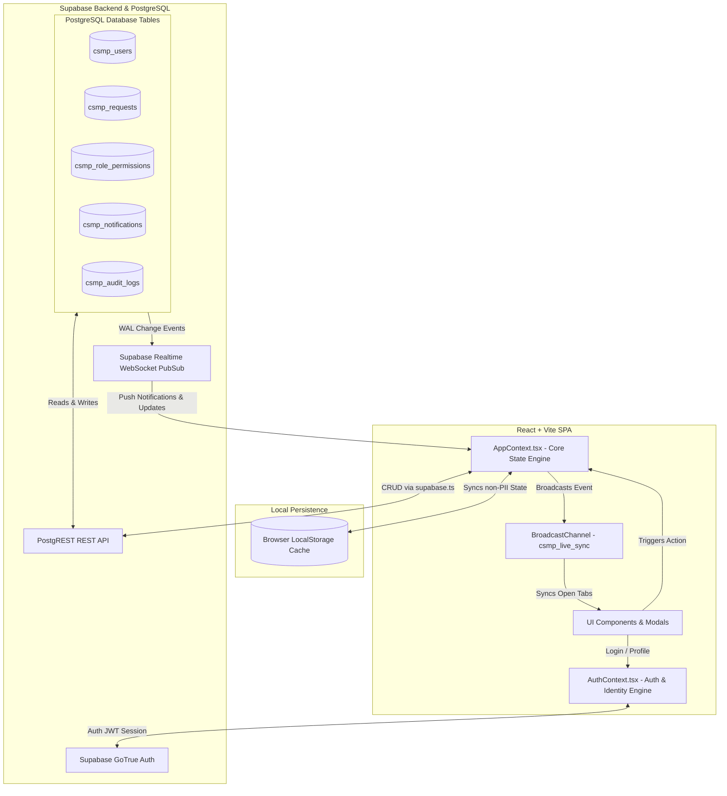

---

## 2. Authentication & Session Flow

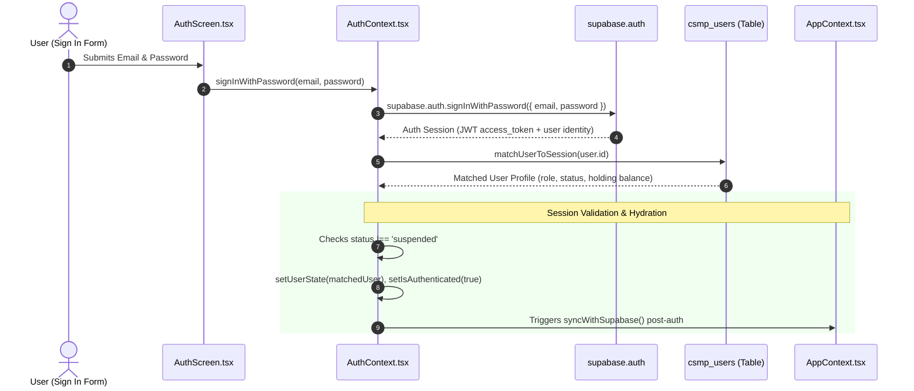

### Key Functions
* **`signInWithPassword(email, password)`** in [`src/context/AuthContext.tsx`](file:///d:/github-clone/egramin/src/context/AuthContext.tsx):
  1. Calls Supabase Auth to authenticate credentials.
  2. Resolves user profile and role from `csmp_users`.
  3. Verifies that the user is not suspended (`status !== 'suspended'`).
  4. Records `USER_SIGNED_IN` audit log into `csmp_audit_logs`.
* **`signOut()`** in [`src/context/AuthContext.tsx`](file:///d:/github-clone/egramin/src/context/AuthContext.tsx):
  1. Calls `supabase.auth.signOut()`.
  2. Clears sensitive state (`requests`, `notifications`, `auditLogs`) in `AppContext`.
  3. Redirects to `/auth` view.
* **`matchUserToSession(authUsr)`** in [`src/context/AuthContext.tsx`](file:///d:/github-clone/egramin/src/context/AuthContext.tsx):
  1. Links `auth.users.id` with `csmp_users.auth_user_id`.
  2. Auto-provisions new users as `client` with `status: 'pending'` if first login.

---

## 3. Support Ticket Creation Flow

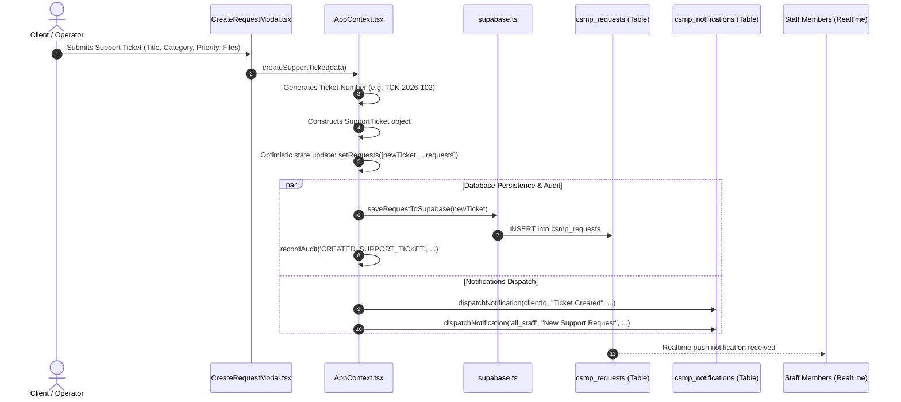

### Key Functions
* **`createSupportTicket(data)`** in [`src/context/AppContext.tsx`](file:///d:/github-clone/egramin/src/context/AppContext.tsx):
  1. Auto-generates ticket sequence (`TCK-YYYY-XXX`).
  2. Formats attachments and environment info (`remoteId`, `browserInfo`).
  3. Dispatches 2 notifications: confirmation to the client and alert to all staff (`all_staff`).
  4. Persists the ticket to `csmp_requests` in Supabase.

---

## 4. Holding / Limit Deposit Request Flow

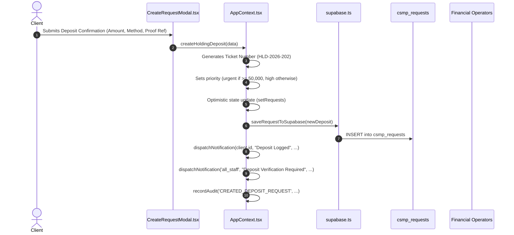

### Key Functions
* **`createHoldingDeposit(data)`** in [`src/context/AppContext.tsx`](file:///d:/github-clone/egramin/src/context/AppContext.tsx):
  1. Generates `HLD-YYYY-XXX` sequence.
  2. Sets deposit method (`bank_deposit`, `imps`, `upi`, `bank_wire`).
  3. Alerts financial operators for transaction proof verification.

---

## 5. Holding / Limit Withdrawal & CMA Checkpoint Flow

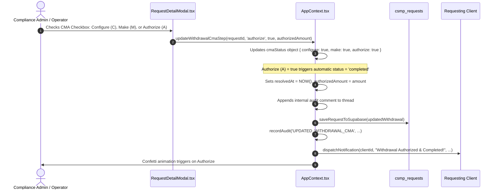

### Key Functions
* **`createHoldingWithdraw(data)`** in [`src/context/AppContext.tsx`](file:///d:/github-clone/egramin/src/context/AppContext.tsx): Logs withdrawal payout request.
* **`updateWithdrawalCmaStep(requestId, step, checked, authorizedAmount)`** in [`src/context/AppContext.tsx`](file:///d:/github-clone/egramin/src/context/AppContext.tsx):
  1. Updates the 3-tier CMA workflow:
     * **C - Configure**: Initial parameter & account validation.
     * **M - Make**: Payout transaction initiation.
     * **A - Authorize**: Final fund release authorization.
  2. When **Authorize (A)** is checked, it **automatically transitions request status to `completed`** and records the final authorized amount.

---

## 6. Request Status Transition Flow

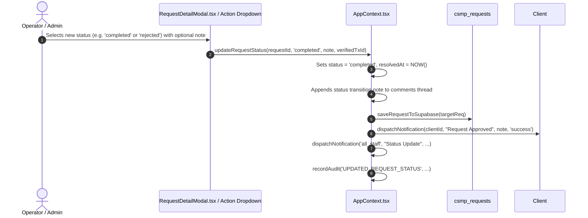

### Key Functions
* **`updateRequestStatus(requestId, newStatus, note, verifiedTxId)`** in [`src/context/AppContext.tsx`](file:///d:/github-clone/egramin/src/context/AppContext.tsx):
  1. Updates status (`pending`, `in_progress`, `completed`, `rejected`).
  2. Sets `resolvedAt` timestamp on terminal states.
  3. Embeds system comment into ticket history.
  4. Dispatches target notifications to both the client and staff logs.

---

## 7. Operator Routing & Assignment Flow

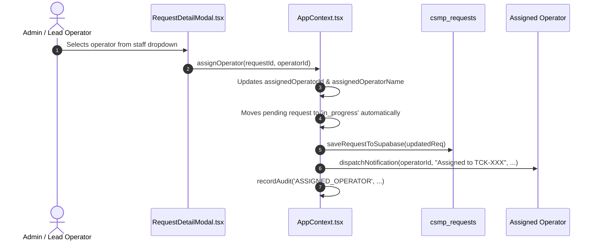

### Key Functions
* **`assignOperator(requestId, operatorId)`** in [`src/context/AppContext.tsx`](file:///d:/github-clone/egramin/src/context/AppContext.tsx):
  1. Resolves operator profile from `allUsers`.
  2. Binds operator to request.
  3. If status was `pending`, automatically upgrades it to `in_progress`.
  4. Sends private notification to the assigned operator's inbox.

---

## 8. Thread Messaging & Internal Staff Notes Flow

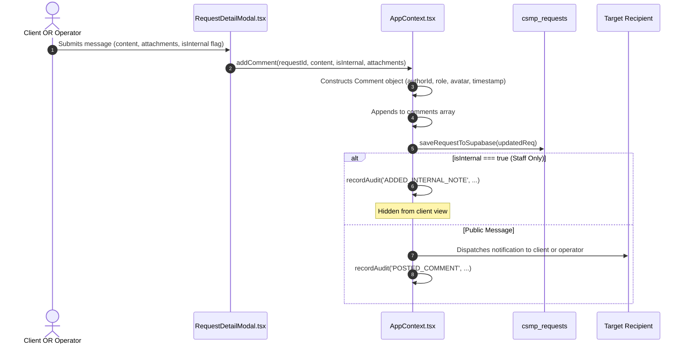

### Key Functions
* **`addComment(requestId, content, isInternal, attachments)`** in [`src/context/AppContext.tsx`](file:///d:/github-clone/egramin/src/context/AppContext.tsx):
  1. Inserts comment with author metadata.
  2. If `isInternal: true`, flags comment for operator/admin view only.
  3. Routes smart notifications: if client replied, notifies assigned operator; if staff replied publicly, notifies client.

---

## 9. Two-Step Deletion & Approval Flow

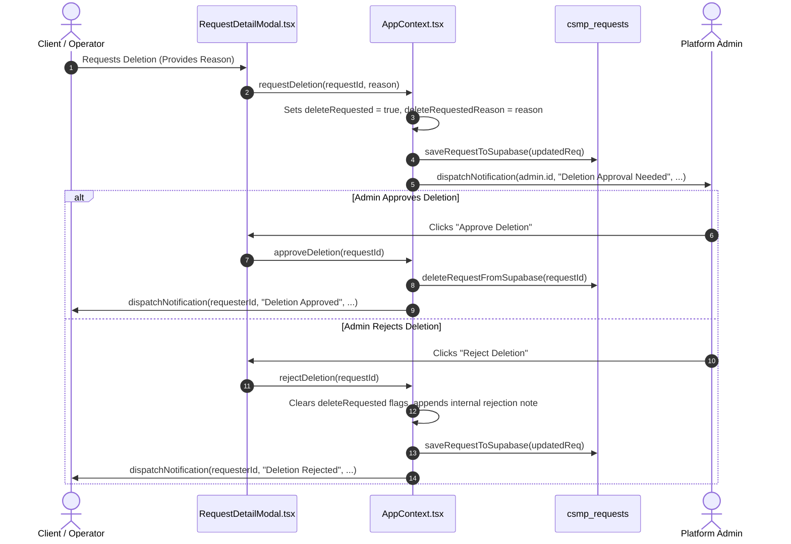

### Key Functions
* **`requestDeletion(requestId, reason)`**: Flags request for admin review without deleting data.
* **`approveDeletion(requestId)`**: Admin permanently deletes request from database.
* **`rejectDeletion(requestId)`**: Admin rejects deletion request and keeps ticket active.

---

## 10. Role-Based Access Control (RBAC) Flow

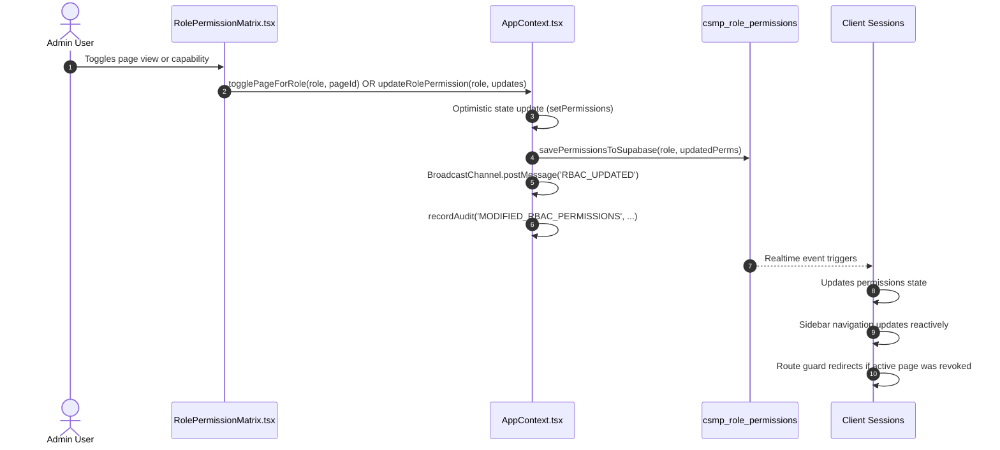

### Key Functions
* **`togglePageForRole(role, pageId)`**: Adds/removes page ID in `allowed_pages` (jsonb).
* **`updateRolePermission(role, updates)`**: Updates functional capabilities and syncs to Supabase.
* **`isPageAllowed(pageId)`**: Evaluates if the current user's role has access to `pageId`.

---

## 11. Multi-Layer Real-Time Synchronization Engine

The application implements a 3-tier synchronization architecture to guarantee real-time updates across distributed sessions:

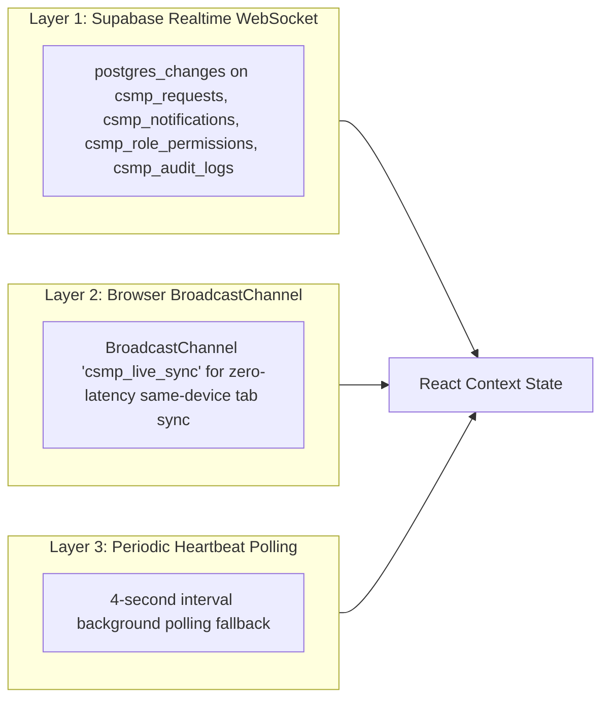

1. **Supabase Realtime Channel (`csmp_realtime_updates`)**:
   * Direct WebSocket subscriptions on PostgreSQL tables (`csmp_requests`, `csmp_notifications`, `csmp_role_permissions`, `csmp_audit_logs`).
   * Pushes database changes to all connected users globally.
2. **Cross-Tab BroadcastChannel (`csmp_live_sync`)**:
   * Instant cross-tab messaging on the same machine without consuming network bandwidth.
3. **Heartbeat Polling Interval (4000ms)**:
   * Self-healing background polling to guarantee consistency under unstable network conditions.

---

## 12. Master Function Reference Index

| Function Name | Location | Triggered When | Description |
|---|---|---|---|
| `signInWithPassword` | `AuthContext.tsx` | User submits login form | Authenticates with Supabase, loads user profile, verifies status. |
| `signOut` | `AuthContext.tsx` | User clicks Sign Out | Terminates auth session, resets sensitive in-memory state. |
| `createSupportTicket` | `AppContext.tsx` | Submitting new support request | Generates `TCK-` ID, uploads attachments, alerts client + staff. |
| `createHoldingDeposit` | `AppContext.tsx` | Submitting deposit slip | Generates `HLD-` ID, alerts finance operators for verification. |
| `createHoldingWithdraw` | `AppContext.tsx` | Submitting withdrawal payout | Generates payout ticket, queues for compliance checks. |
| `updateWithdrawalCmaStep` | `AppContext.tsx` | Clicking C, M, or A checkpoint | Manages 3-step CMA workflow; Authorize (A) auto-completes request. |
| `updateRequestStatus` | `AppContext.tsx` | Status dropdown changed | Updates status (`pending`, `in_progress`, `completed`, `rejected`), logs note, triggers confetti on complete. |
| `assignOperator` | `AppContext.tsx` | Selecting operator in modal | Assigns staff member, upgrades status to `in_progress`, notifies operator. |
| `addComment` | `AppContext.tsx` | Posting comment or internal note | Adds public reply or internal staff note to thread, routes notifications. |
| `requestDeletion` | `AppContext.tsx` | Clicking "Request Deletion" | Submits deletion proposal with reason for admin review. |
| `approveDeletion` | `AppContext.tsx` | Admin clicks "Approve Deletion" | Permanently deletes request from database. |
| `rejectDeletion` | `AppContext.tsx` | Admin clicks "Reject Deletion" | Clears deletion flag, logs rejection note to thread. |
| `togglePageForRole` | `AppContext.tsx` | Clicking page checkbox in RBAC | Updates `allowed_pages` (jsonb) column for role in `csmp_role_permissions`. |
| `updateRolePermission` | `AppContext.tsx` | Clicking capability toggle in RBAC | Updates operational flags in `csmp_role_permissions`. |
| `markNotificationAsRead` | `AppContext.tsx` | Clicking notification item | Marks single notification as read in database. |
| `markAllNotificationsAsRead` | `AppContext.tsx` | Clicking "Mark All Read" | Bulk updates unread notifications in database. |
| `checkSupabaseHealth` | `supabase.ts` | Settings view / Health check | Probes database connectivity, measures latency, returns table counts. |
| `exportRequestsToCSV` | `storage.ts` | Clicking "Export CSV" | Serializes filtered request dataset into downloadable CSV spreadsheet. |
