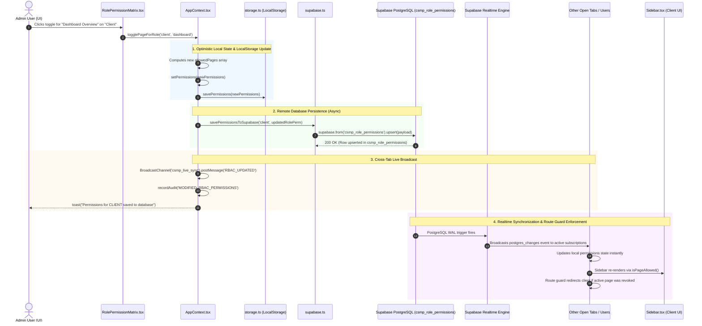

# Role-Based Access Control (RBAC) System: Architecture & Code Flow

This document provides a comprehensive technical blueprint and step-by-step execution trace of how the Role-Based Access Control (RBAC) matrix operates across the frontend UI, React Context state, Supabase PostgreSQL database, and Realtime synchronization layers.

---

## 1. System Architecture Diagram



---

## 2. End-to-End Execution Trace: Clicking a Page Toggle

Here is the exact step-by-step chain of events when an administrator clicks a checkbox (for example, toggling **Dashboard Overview** for the **Client** role):

### Step 1: User Interaction in `RolePermissionMatrix.tsx`
* **File:** [`src/components/rbac/RolePermissionMatrix.tsx`](file:///d:/github-clone/egramin/src/components/rbac/RolePermissionMatrix.tsx)
* **Function Triggered:** `onClick={() => togglePageForRole(r, p.id)}`
* **What happens:**
  1. The UI checks if the role is administrator-locked (e.g. `dashboard` and `rbac` cannot be disabled for `admin`).
  2. For the `client` role, it invokes `togglePageForRole('client', 'dashboard')`.

---

### Step 2: Page List Resolution in `AppContext.tsx`
* **File:** [`src/context/AppContext.tsx`](file:///d:/github-clone/egramin/src/context/AppContext.tsx)
* **Function:** `togglePageForRole(role: UserRole, pageId: PageId)`
```typescript
const togglePageForRole = (role: UserRole, pageId: PageId) => {
  const currentAllowed = permissions[role]?.allowedPages || [];
  const isPresent = currentAllowed.includes(pageId);
  const newPages = isPresent
    ? currentAllowed.filter(p => p !== pageId)
    : [...currentAllowed, pageId];

  updateRolePermission(role, { allowedPages: newPages });
};
```
* **What happens:**
  1. Retrieves the current `allowedPages` array for the target role (`['support', 'holding']`).
  2. If `dashboard` was missing, it adds `'dashboard'` $\rightarrow$ `['support', 'holding', 'dashboard']`.
  3. Passes the updated object `{ allowedPages: newPages }` into `updateRolePermission`.

---

### Step 3: Optimistic Update & Audit Logging in `AppContext.tsx`
* **File:** [`src/context/AppContext.tsx`](file:///d:/github-clone/egramin/src/context/AppContext.tsx)
* **Function:** `updateRolePermission(role: UserRole, updates: Partial<RolePermissions>)`
```typescript
const updateRolePermission = async (role: UserRole, updates: Partial<RolePermissions>) => {
  const updatedRolePerm = { ...permissions[role], ...updates };
  const updated = {
    ...permissions,
    [role]: updatedRolePerm,
  };

  // 1. Optimistic local update
  setPermissions(updated);
  savePermissions(updated);

  // 2. Persist to Supabase
  try {
    await savePermissionsToSupabase(role, updatedRolePerm);
    toast(`Permissions for ${role.toUpperCase()} saved to database.`, 'success');
  } catch (err: any) {
    ...
  }

  // 3. Same-device cross-tab sync
  const bc = new BroadcastChannel('csmp_live_sync');
  bc.postMessage({ type: 'RBAC_UPDATED', payload: { role, perms: updatedRolePerm } });
  bc.close();

  // 4. Audit Log
  recordAudit('MODIFIED_RBAC_PERMISSIONS', 'rbac', role, `Updated capabilities for role [${role.toUpperCase()}]`);
};
```
* **What happens:**
  1. **Instant UI Response:** Updates React state (`setPermissions`) and caches to `localStorage` (`savePermissions`). The checkbox flips immediately with zero delay.
  2. **Database Write:** Calls `savePermissionsToSupabase` asynchronously.
  3. **Local Cross-Tab Sync:** Broadcasts an `RBAC_UPDATED` message across all open tabs on the admin's machine using `BroadcastChannel`.
  4. **Audit Trail:** Appends an immutable audit log entry into `csmp_audit_logs`.

---

### Step 4: Supabase Database Upsert in `supabase.ts`
* **File:** [`src/lib/supabase.ts`](file:///d:/github-clone/egramin/src/lib/supabase.ts)
* **Function:** `savePermissionsToSupabase(role: UserRole, perms: RolePermissions)`
```typescript
export async function savePermissionsToSupabase(role: UserRole, perms: RolePermissions): Promise<void> {
  const payload = {
    role,
    allowed_pages: perms.allowedPages ?? [],
    can_create_request: Boolean(perms.canCreateRequest),
    can_change_status: Boolean(perms.canChangeStatus),
    can_assign_operator: Boolean(perms.canAssignOperator),
    can_add_internal_notes: Boolean(perms.canAddInternalNotes),
    can_view_all_clients: Boolean(perms.canViewAllClients),
    can_manage_roles: Boolean(perms.canManageRoles),
    can_export_reports: Boolean(perms.canExportReports),
    can_view_audit_logs: Boolean(perms.canViewAuditLogs),
    updated_at: new Date().toISOString(),
  };

  const { error } = await supabase
    .from('csmp_role_permissions')
    .upsert(payload, { onConflict: 'role' });

  if (error) throw error;
}
```
* **What happens:**
  1. Serializes `allowedPages` into a JSON array for the PostgreSQL `jsonb` column `allowed_pages`.
  2. Executes an `UPSERT` targeting the primary key `role = 'client'`.
  3. Updates `updated_at` to the current UTC timestamp.

---

### Step 5: Realtime Event Broadcast & Client Reaction
* **Engine:** Supabase PostgreSQL Realtime Engine
* **Subscription Listener in `AppContext.tsx`:**
```typescript
.on('postgres_changes', { event: '*', schema: 'public', table: 'csmp_role_permissions' }, (payload: any) => {
  if (payload?.new && payload.new.role) {
    const role = payload.new.role as UserRole;
    const pages = Array.isArray(payload.new.allowed_pages)
      ? payload.new.allowed_pages
      : JSON.parse(payload.new.allowed_pages || '[]');

    setPermissions(prev => ({
      ...prev,
      [role]: { ...prev[role], allowedPages: pages }
    }));
  }
})
```
* **What happens across other connected devices & users:**
  1. PostgreSQL triggers a Write-Ahead Log (WAL) publication event.
  2. Supabase pushes the new row to all active WebSocket clients.
  3. Client browsers receive `payload.new` and update their `permissions` state automatically without reloading.

---

### Step 6: Reactive Sidebar & Navigation Guard Enforcement
* **Files:** [`src/components/layout/Sidebar.tsx`](file:///d:/github-clone/egramin/src/components/layout/Sidebar.tsx), [`src/context/AppContext.tsx`](file:///d:/github-clone/egramin/src/context/AppContext.tsx)
* **What happens:**
  1. **Sidebar Visibility:** `Sidebar.tsx` executes `isPageAllowed(item.id)`:
     ```typescript
     const allowedPages: PageId[] = rolePerm?.allowedPages ?? [];
     const isPageAllowed = (page: PageId) => allowedPages.includes(page);
     ```
     If `dashboard` was added for `client`, the **Dashboard** navigation link appears in the client's sidebar instantly.
  2. **Security Route Guard:** If a page is **revoked** while a client is currently viewing it, `AppContext.tsx` detects that `isPageAllowed(currentPage)` returned `false` and immediately redirects the user to their default accessible landing view.

---

## 3. Function & File Reference Summary

| File | Function / Hook | Purpose |
|---|---|---|
| [`RolePermissionMatrix.tsx`](file:///d:/github-clone/egramin/src/components/rbac/RolePermissionMatrix.tsx) | `togglePageForRole(role, pageId)` | User interaction handler triggered by clicking any page checkbox. |
| [`AppContext.tsx`](file:///d:/github-clone/egramin/src/context/AppContext.tsx) | `togglePageForRole` | Computes updated page array (adds or removes page). |
| [`AppContext.tsx`](file:///d:/github-clone/egramin/src/context/AppContext.tsx) | `updateRolePermission` | Applies optimistic update, calls Supabase, broadcasts cross-tab, logs audit. |
| [`supabase.ts`](file:///d:/github-clone/egramin/src/lib/supabase.ts) | `savePermissionsToSupabase` | Performs database `UPSERT` on `csmp_role_permissions` (`allowed_pages` jsonb). |
| [`supabase.ts`](file:///d:/github-clone/egramin/src/lib/supabase.ts) | `fetchPermissionsFromSupabase` | Queries all permissions on startup / background sync and auto-seeds if table is empty. |
| [`AppContext.tsx`](file:///d:/github-clone/egramin/src/context/AppContext.tsx) | `postgres_changes` listener | Listens to WebSocket events from Supabase and applies updates from remote admins. |
| [`Sidebar.tsx`](file:///d:/github-clone/egramin/src/components/layout/Sidebar.tsx) | `isPageAllowed(item.id)` | Filters sidebar items reactively based on the active role's `allowedPages`. |
| [`app.type.ts`](file:///d:/github-clone/egramin/src/types/app.type.ts) | `APP_PAGE_DEFINITIONS`, `DbRolePermission` | Source of type safety, page metadata catalogue, and database contract definitions. |
